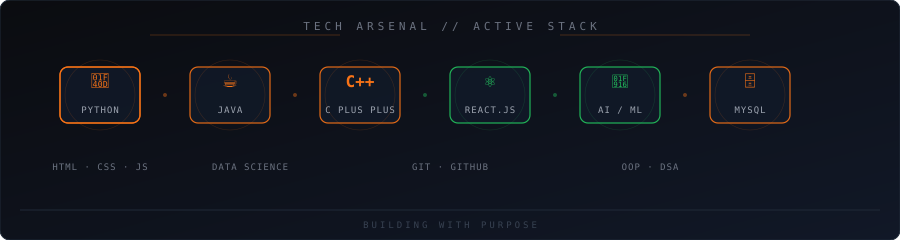
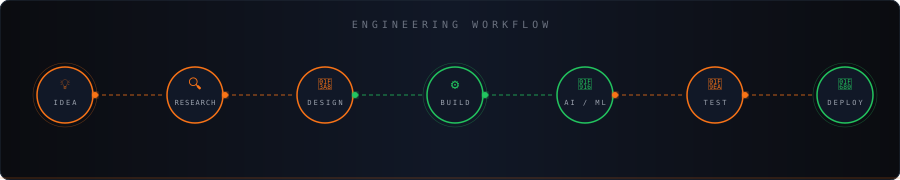

 

  

&nbsp;

&nbsp;

&nbsp;

 

## 👨‍💻 About Me

I'm a **3rd-year B.Tech Information Technology student** at **Sri Krishna College of Technology, Coimbatore** with a **CGPA of 8.70 / 10.00**.

I build application-oriented projects across **software development, artificial intelligence, machine learning, and data-driven systems**, with a core stack spanning **Python, Java, C++, React.js, and MySQL**.

- 🥉 **3rd Rank** in the Information Technology Department — 2nd & 3rd semesters
- 🎯 Exploring software engineering and AI/ML internship opportunities
- 🛠️ Currently working with React.js, Python, and ML workflows

## ⚡ Tech Stack

## 🔧 Engineering Workflow

## 🚀 Featured Projects

<table>
<tr>
<td width="50%" valign="top">

### 🏥 GN MedCare

**Smart Medical Assistance Platform**

A healthcare and pharmacy assistance platform supporting billing, prescription management, and data-driven operational workflows.

**Stack:** React.js · Python · Machine Learning · MySQL

</td>

<td width="50%" valign="top">

### 🔐 AI Transparency Platform

**Data Usage Control & Consent Management**

A platform focused on improving transparency and user control over how personal data is utilized by AI systems.

**Stack:** React.js · MySQL

</td>
</tr>

<tr>
<td width="50%" valign="top">

### 🎯 SkillMatch AI

**Career Recommendation System**

An AI-based system that analyzes user skills and maps them to suitable career paths using machine learning.

**Stack:** Python · Machine Learning · React.js · JavaScript

</td>

<td width="50%" valign="top">

### 🌐 Manufolio

**Personal Portfolio Website**

A responsive, interactive personal portfolio built with React.js showcasing skills, projects, certifications, and technical journey.

**Stack:** React.js · JavaScript

</td>
</tr>
</table>

## 📊 GitHub Activity

  

&nbsp;

&nbsp;

## 🏆 Highlights

- 🥉 **3rd Rank — IT Department** across 2nd & 3rd semesters at Sri Krishna College of Technology
- 🎓 **Class Representative** for 2 consecutive years
- 👨‍💼 **Secretary — Ignite Tech Community**

## 📜 Certifications

- **Programming, Data Structures & Algorithms using Python** — NPTEL / IIT Madras · Score: 60% · Jul–Sep 2025
- **Introduction to Large Language Models (LLMs)** — NPTEL / IIT Madras · Score: 54% · Jan–Apr 2026
- **AWS Cloud Practitioner Essentials** — AWS Training & Certification · Completed Jul 2026
- **Object-Oriented Design** — University of Alberta · Coursera
- **Java Programming: Comprehensive Bootcamp** — Infosys Springboard
- **Multi-Paradigm Programming with Modern C++** — Infosys Springboard

## 🏁 Technical Participation

- **VEL IDEAFORGE 2K26** — National Level 24-Hour Hackathon · Vel Tech Rangarajan Dr. Sagunthala R&D Institute · February 19–20, 2026 · Participant
- **KRIYA Ideathon 2026** — PSG College of Technology Students Union · March 13–15, 2026 · Participant
- **Paper Presentation — Digital Innovators** — Sri Ramakrishna Engineering College · SREC Utsava'26 · January 30–31, 2026 · Participant

## 🌐 Connect

 

&nbsp;

&nbsp;

 

